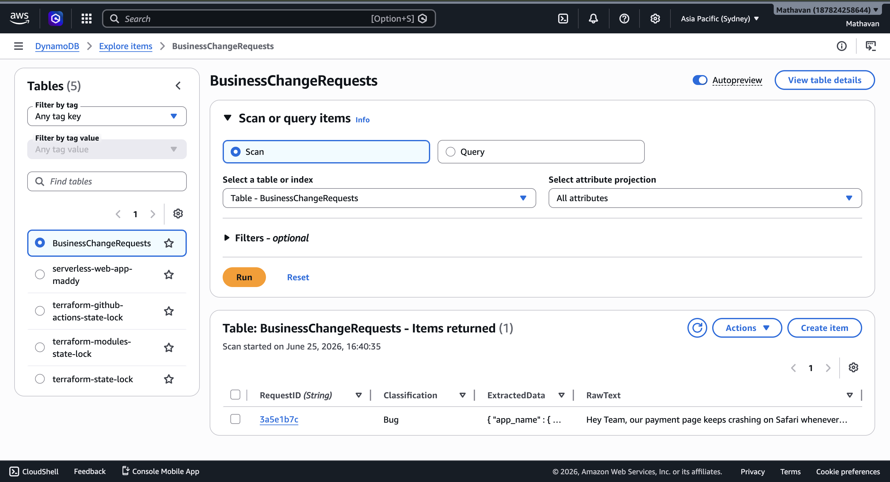
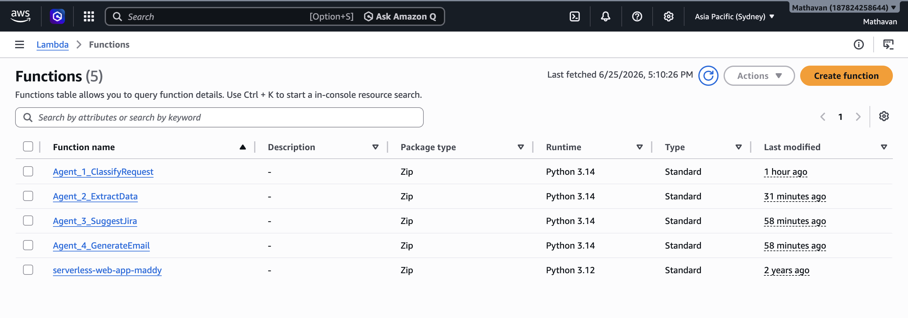
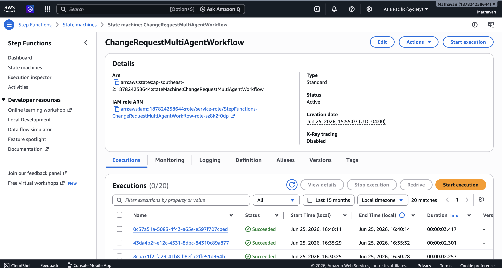
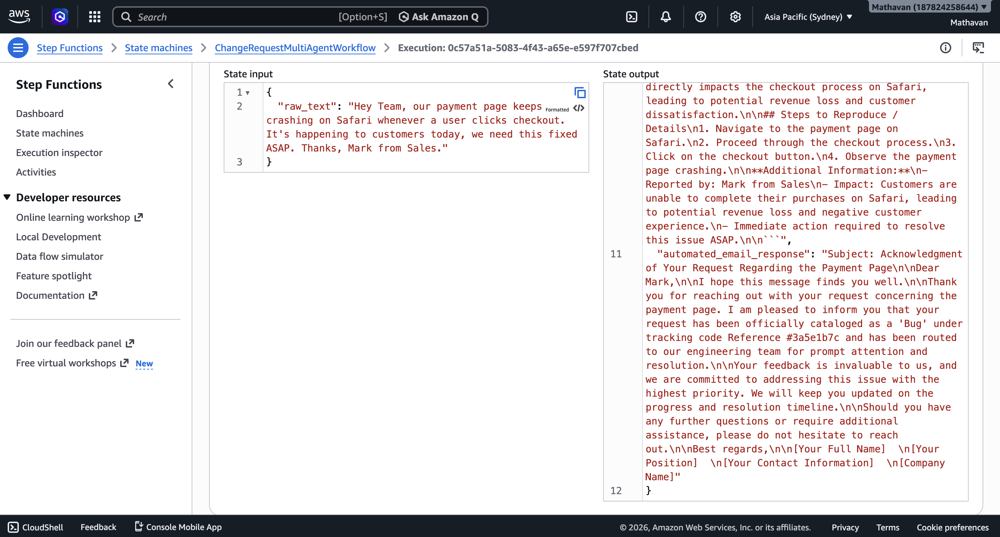

# 🚀 Serverless AI Multi-Agent AI Orchestration Pipeline

A production-grade, event-driven multi-agent AI assembly line built using **AWS Step Functions**, **Amazon Bedrock (Nova Micro)**, **AWS Lambda**, and **Amazon DynamoDB**.

Business Change Request Automation System - This system showcases how to orchestrate multiple specialized AI agents sequentially without relying on rigid, heavy, hard-coded code-chaining application frameworks. By leveraging native cloud orchestration, the pipeline handles raw, unstructured corporate data, refines it, saves it to a persistent database trail, and generates actionable enterprise outputs.

---

## 🏗️ Architecture Overview

The pipeline executes an automated data processing assembly line split across 4 distinct serverless microservice layers:

1. **Agent 1 (Classify Request):** Evaluates incoming raw text payloads to determine business classification tier and urgency categorization.
2. **Agent 2 (Extract Data):** Implements localized extraction prompts to parse unstructured details into strict, flat JSON objects, logging structural attributes into a NoSQL datastore. (Dynamo DB)
3. **Agent 3 (Suggest Jira Spec):** Processes the parsed telemetry variables to generate structured technical feature specifications mapped directly to software engineering backlogs.
4. **Agent 4 (Generate Email):** Drafts context-aware, enterprise-ready communications tailored to stake-holders based on the data outputs derived downstream.










---

## 🛠️ The Tech Stack

* **Orchestration Engine:** AWS Step Functions (utilizing cutting-edge JSON data payload state transformations)
* **Compute / Serverless Layer:** AWS Lambda (Python 3.14 / Optimized Boto3 SDK runtimes)
* **AI Core Client:** Amazon Bedrock (`amazon.nova-micro-v1:0` natively hosted in the Sydney ap-southeast-2 region)
* **Database Platform:** Amazon DynamoDB (NoSQL persistent audit logging)
* **Identity Management:** AWS IAM (Strict, explicit identity-based execution roles and inline policies)

---

## 🚀 Key Engineering Triumphs & Edge Cases Solved

Building real-world distributed AI architectures requires navigating unexpected cloud hurdles. Here are the specific engineering roadblocks conquered in this project:

### 1. Upstream Model Deprecation Lifecycle Upgrades
* **Challenge:** Managing legacy workflow dependencies shifting away from deprecated model boundaries.
* **Resolution:** Adapted the entire Lambda payload payload mapping to leverage native **Amazon Nova Micro** clusters inside `ap-southeast-2`, keeping regional processing latency ultra-low and reducing inference overhead costs.

### 2. Defusing the "AI Markdown Trap" via Defensive Parsing
* **Challenge:** Large Language Models frequently wrap JSON answers inside structural markdown text wrappers (e.g., ` ```json ... ``` `), which instantly crashes standard `json.loads()` functions.
* **Resolution:** Implemented advanced, defensive string manipulation routines directly into the ingestion layer to scrub markdown annotations automatically prior to token parsing.

### 3. Exposing Hidden Silent Failures
* **Challenge:** Early monolithic `try/except` constructs captured parsing failures but inadvertently swallowed adjacent DynamoDB `put_item` execution blocks. This caused AWS Step Functions to display a false, misleading green success state while silent write drops happened under the hood.
* **Resolution:** Decoupled data parsing from database persistence layers. Moved the database write operation directly outside of the error exception logic traps to enforce strict schema verification validation and surface explicit IAM profile errors.

---


